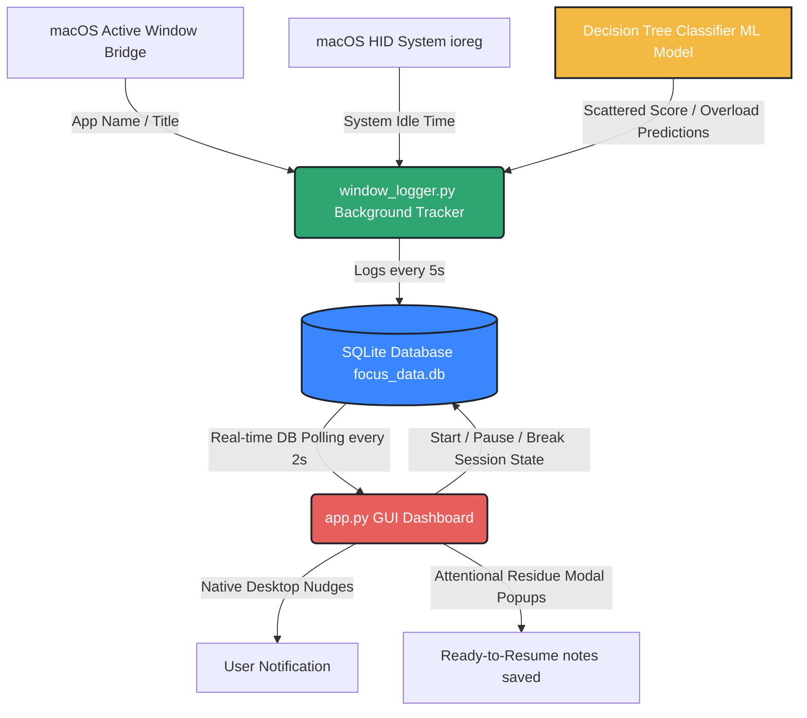

# Cognitive Behavior Tracker & Attentional Coach

A 100% local, behavioral analytics desktop application and active study session assistant designed to diagnose context switching, prevent background attentional residue, and track mental fatigue in real-time.



---

## 🚀 Core Features & Attentional Coach Intelligence

### 1. Automated Passive Tracking on Startup
No manual configuration or start triggers required. The application starts in `"Active"` state instantly on launch. The background tracker immediately commences window tracking and system AFK idle checks.

### 2. Simple Horizontal Event Timeline
Replaces generic average charts with an authentic event timeline slider:
- **Grouped sessions**: Multiple raw 5-second log rows are merged into chronological sessions of continuous activity.
- **High-Premium Progress Rail**: Plots a centered horizontal track slider (`height=0.2`) in the background, drawing colored event blocks (`height=0.3`) on top of it.
- **Matplotlib Theming**: Uses light vertical hourly gridlines and auto-scales parameters to match local timezone formats.
- **Color-Coded Status Tags**:
  - 🟩 **Deep Work** (`#2FA572`)
  - 🟥 **Distractions** (`#E65F5C`)
  - 🟦 **Neutral Communication** (`#3A86FF`)
  - 🟪 **Idle / AFK** (`#8D96A5`)

### 3. Native macOS Idle (AFK) time monitoring
- Natively queries macOS `ioreg HIDIdleTime` zsh outputs with zero external package dependencies.
- If the system is idle for **60 seconds or more**, the tracker automatically overrides the active window log to `"Idle"` (Away From Keyboard) and category `'Idle'`.
- Overload load values automatically decay by `2.0` points per tick when idle to represent cognitive recovery.

### 4. Smart Self-App Ignore Filter
- The dashboard app processes (`Python`, `customtkinter`, `tk`) are automatically filtered out from active window tracking inputs.
- Viewing the dashboard acts as a resting state (`"Idle"`) and decays cognitive load, preventing false feedback loops.

### 5. Attentional Overload Analysis & Active Protection
- Integrates a local machine learning engine (Decision Tree Classifier trained on focus datasets) to predict active cognitive overloading.
- **Active Focus Protection**: Overload predictions are bypassed if you are in a healthy, active focus block (`category == "Work"` and focused for less than 15 minutes), completely eliminating false positive overload alerts during productive focus sessions.

### 6. Attentional Residue Popups
- Tracks switches from high-severity work to distractions. If you've been working continuously for $\ge 2$ minutes and switch to leisure, the dashboard opens a top-level modal asking you to write a **Ready-to-Resume note** to help offload your background cognitive threads.

### 7. Launch Database Auto-Wipe
- To prevent database size bloat and state corruptions, the application **automatically deletes the database (`focus_data.db`) on application start**. Every run begins completely fresh, logging 100% of your real-life active data.

---

## 📂 Repository Workspace Structure

The project uses an "All-Python" concurrent architecture divided into clean workspace components:

```text
Cognitive-Behavior-Tracker/
│
├── tracker_engine/          # (Data Engineer's workspace)
│   └── window_logger.py     # Captures active front window, macOS idle time, and writes logs to SQLite
│
├── ml_model/                # (Cognitive Modeler's workspace)
│   ├── synthetic_data.py    # Generates focus logs to test the ML models
│   ├── logic.py             # Trains the decision tree model and runs live brain analysis
│   └── synthetic_focus_data.csv # Synthetic focus training dataset
│
├── ui_dashboard/            # (HCI & Frontend Dev's workspace)
│   └── app.py               # Renders customtkinter UI, Matplotlib timelines, dynamic Top Apps lists, and comparison sparklines
│
├── database/                # (Storage)
│   └── focus_data.db        # Live SQLite focus database (Created at startup)
│
├── requirements.txt         # Project package dependencies
├── .gitignore               # Excludes SQLite databases and local virtual environments
└── README.md                # Project documentation (You are here)
```

---

## 🛠️ Installation & Getting Started

### 1. Set Up a Virtual Environment (First time only)
Run this command from your terminal inside the root directory to create your virtual environment:
```bash
python3 -m venv venv
```

### 2. Activate the Virtual Environment
Activate the environment (Run this command in any new terminal tab before working on the project):
```bash
source venv/bin/activate
```

### 3. Install Dependencies
Install all required UI and analytical python packages into your environment:
```bash
pip install -r requirements.txt
```

### 4. macOS Tkinter Trouble-shooting
If you get a `ModuleNotFoundError: No module named '_tkinter'` error, it means python was installed without Tkinter. Keep your virtual environment active and run:
```bash
brew install python-tk@3.13
```

### 5. Running the Application
Launch the dashboard directly:
```bash
python3 ui_dashboard/app.py
```
*(The silent background logger subprocess is automatically spawned and terminated cleanly by the main GUI thread!)*